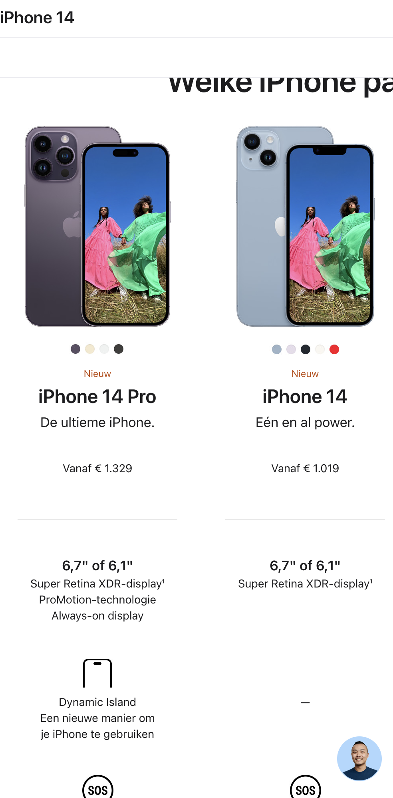

# Procesverslag
Markdown is een simpele manier om HTML te schrijven.  
Markdown cheat cheet: [Hulp bij het schrijven van Markdown](https://github.com/adam-p/markdown-here/wiki/Markdown-Cheatsheet).

Nb. De standaardstructuur en de spartaanse opmaak van de README.md zijn helemaal prima. Het gaat om de inhoud van je procesverslag. Besteedt de tijd voor pracht en praal aan je website.

Nb. Door *open* toe te voegen aan een *details* element kun je deze standaard open zetten. Fijn om dat steeds voor de relevante stuk(ken) te doen.

## Jij

  
uitwerken voor kick-off werkgroep

  ### Auteur:
  Robin Bodlaender

  #### Je startniveau:
  Rood

  #### Je focus:
  Focus: responsive
 

## Je website

  
uitwerken voor kick-off werkgroep

  ### Je opdracht:
  https://apple.com/nl

  #### Screenshot(s) van de eerste pagina (small screen): 
  Apple homepage 
  

  #### Screenshot(s) van de tweede pagina (small screen):
  Koop iPhone pagina 
  
 

## Toegankelijkheidstest 1/2 (week 1)

  
uitwerken na test in 1e werkgroep

  ### Bevindingen
  Lijst met je bevindingen die in de test naar voren kwamen:

  #### Screenreader
  Het werken met de screenreader vond ik heel erg interessant. Ik had wel eens van een screenreader gehoord, maar ik dacht altijd dat dit een soort fysiek apparaat was. Het bedienen van de screenreader is heel erg lastig. Het lukte mij slecht om door de website te kunnen navigeren. Ik heb ontdekt dat veel websites slecht geoptimaliseerd zijn voor een screenreader. Daarom weet ik nu hoe deste belangrijker het is om dit wel te doen en bijvoorbeeld goed gebruik te maken van alt-teksten.

  #### Muis en Toetsenbord 
  Tijdens dit experiment heb ik ontdekt hoe belangrijk een muis en toetsenbord zijn bij het biedienen van een webpagina. Toen ik bijvoorbeeld alleen mijn toesenbord mocht gebruiken en dus door een pagina heen moest tabben, merkte ik dat er veel websitye elementen helemaal niet duidelijkl als link zijn aangegeven. Voor iemand die geen muis kan gebruiken is het dan dus erg lastig om door de website heen te bladeren.

  #### Motoriek (shocks, elastiekjes)
  Tijdens het experiment met het schokapparaat heb ik ondervonden hoe het is als je met motorische problemen een website moet bedienen. Dit kan zijn doordat je je spieren niet goed onder controle hebt, of omdat je bijvoorbeeld heel veel aan het trillen bent. Doordat ik tijdens de oefening erg hard aan het trillen was was het veel lastiger om op bepaalde buttons te klikken. In praktijk zou het voor deze mensen dus fijn zijn om een versie van de website te maken zonder erg kleine elementen, zodat alles makkelijker aan te klikken is.

  #### Visueel (brillen, contrast, kleurenblind, dark/light). 
  Bij deze oefening moesten we door verschillende brillen kijken naar de website. Ik vond dat deze visuele beperkingen de minst heftige beperking is van de voorgenoemde beperkingen, omdat de gebruiker nog wel helemaal normaal door de website heen kan bladeren. Bij sommige brillen was het wel een stuk lastiger om sommige contrasten op de website te bekijken. Websites zouden hier rekening mee kunnen houden door op sommige elementen het contrast te verhogen, of een speciale versie maken voor mensen met een visuele beperking.

## Breakdownschets (week 1)

  
uitwerken na afloop 2e werkgroep

  ### de hele pagina: 
  

  ### dynamisch deel (bijv menu): 
  

  

## Voortgang 1 (week 2)

  
uitwerken voor 1e voortgang

  ### Stand van zaken
  De eerste week ben ik begonnen met de HTML-structuur van mijn website opzetten. Zo heb ik mijn website vergeleken met de website van Apple (de website die ik namaak) om te kijken en besluiten welke elementen ik wel en niet over ga nemen op mijn eigen website. Ook ben ik mij gaan verdiepen in hoe ik bepaalde elementen van mijn website werkend moet krijgen via css. Denk bijvoorbeeld aan hoe ik via flexbox elementen naast elkaar heb gekregen, en hoe ik via grid een mooie kolommenstructuur heb gemaakt.

  

  ### Agenda voor meeting
  - Vragen stellen aan de studentenassistenten over flexbox
  - Vraag stellen over lijst menu
  - Feedback vragen over mijn website

  

  ### Verslag van meeting
  - Flexbox problemen zijn opgelost
  - Menu probleem is opgelost, het moesten links in de list worden
  - Feedback gekregen, en aan mijn website gaan werken

## Voortgang 2 (week 3)

  
uitwerken voor 2e voortgang

  ### Agenda voor meeting
  - CSS vragen stellen
  - Grid werkt niet goed, hier vraag over stellen
  - Vraag over 2e pagina stellen
  
  ### Verslag van meeting
  
  - CSS vragen zijn beantwoord, ik kan nu weer even vooruit
  - Grid probleem is opgelost, ik had iets verkeerd geteld
  - Vragen over 2e pagina zijn beantwoord

## Toegankelijkheidstest 2/2 (week 4)

  
uitwerken na test in 8e werkgroep

  ### Bevindingen 
  Lijst met je bevindingen die in de test naar voren kwamen (geef ook aan wat er verbeterd is):

  #### Screenreader
  Tijdens het testen met de screenreader ontdekte ik dat sommige elementen en links op mijn website niet herkend werden door de screenreader. Vervolgens ben ik aan de slag gegaan met deze elementen en heb ik een betere html-structuur gemaakt waardoor alles nu wel wordt herkend door de screenreadeer.

  #### Muis en Toetsenbord 
  Net zo als bij de screenreader werden sommige elementen bij het tabben door de website niet goed herkend. Daarom ben ik aan de slag gegaan met deze elementen en heb ik een betere html-structuur gemaakt waardoor alles nu wel wordt herkend door de tap-toets.

  #### Motoriek (shocks, elastiekjes)
  Bij het oefenen met het schokappaaraat hdeb ik gemerkt dat mijn website bijna volledig goed te besturen is tijdens trillende handen. Sommige atrubuten waren wel wat lastig om aan te klikken. Eigenlijk zou ik deze atributen dus groter moetenmaken, maar daardoor zou het design van de website verloren gaan. Daarom heb ik er voor gekozen dit niet te doen. Als ik voor deze opdracht meer tijd zou hebben zou ik een speciale versie van deze pagina's maken met grotere knoppen en atributen zodat deze voor mensen met een beperking makkelijker aan te klikken zijn.

  #### Visueel (brillen, contrast, kleurenblind, dark/light). 
  Bij het oefenen met het de kleurenbrillen hdeb ik gemerkt dat mijn website bijna volledig goed te bekijken is. Bij sommige elementen was het contrast alleen iets minder duidelijk. Eigenlijk zou ik deze atributen met een groter contrast moeten maken, maar daardoor zou het design van de website verloren gaan. Daarom heb ik er voor gekozen dit niet te doen. Als ik voor deze opdracht meer tijd zou hebben zou ik een speciale versie van deze pagina's maken met grotere contrasten zodat deze voor mensen met een visuele beperking makkelijker te zien en te onderscheiden zijn.

## Voortgang 3 (week 4)

  
uitwerken voor 3e voortgang

  ### Agenda voor meeting
  - Vragen hoe ik cursor kan veranderen
  - Margin werkt niet, hier vraag over stellen
  - Feedback vragen

  ### Verslag van meeting
  - Cursor veranderen werkt niet, waarschijnlijk fout in OS, dus voor nu concentreren op andere onderdelen op mijn website
  - Margin probleem is opgelost, was ergens een klein foutje dat nu is verholpen.

## Eindgesprek (week 5)

  
uitwerken voor eindgesprek

  ### Je uitkomst - karakteristiek screenshots:
  

  ### Dit ging goed/Heb ik geleerd: 
  Tijdens dit vak heb ik heel erg veel geleerd. Om te beginnen vond ik voordat ik aan dit vak begon coderen verschikkelijk. Ik was er ook nog niet erg goed in, en bij terme als flexbox werd ik doodsbang. Maar door de duidelijke oefeningen via CodePen heb ik stapje voor stapje essentiele onderdelen geleerd. Ik begon het coderen ook steeds meer als een leuke puzzel te zien in plaats van iets saais. Ik heb mij er heel erg om verbaasd dat met coderen echt letterlijk alles mogelijk is op een webpagina. Ik heb dus heel erg veel geleerd en ben erg blij dat ik coderen nu een stuk leuker ben gaan vinden.

  

  ### Dit was lastig/Is niet gelukt:
  ALs ik meer tijd zou hebben dan zou ik het JavaScript onderdeel nog wat verder willen uitwerken. Ik ben al best ver gekomen met JavaScript, maar ik had hier graag nog wat meer over geleerd om te ontdekken wat er allemaal mogelijk is.

  

## Bronnenlijst

  
continu bijhouden terwijl je werkt

  Nb. Wees specifiek ('css-tricks' als bron is bijv. niet specifiek genoeg).

  1. https://css-tricks.com/using-css-cursors/
  2. https://css-tricks.com/snippets/css/a-guide-to-flexbox/
  3. https://css-tricks.com/almanac/
  4. https://stackoverflow.com/questions/12631420/play-a-sound-on-page-load-using-javascript
  5. https://www.w3schools.com/howto/howto_css_custom_scrollbar.asp

# Fed2
# Fed2
# Fed2
# Fed2
# Fed2
# Fed2
